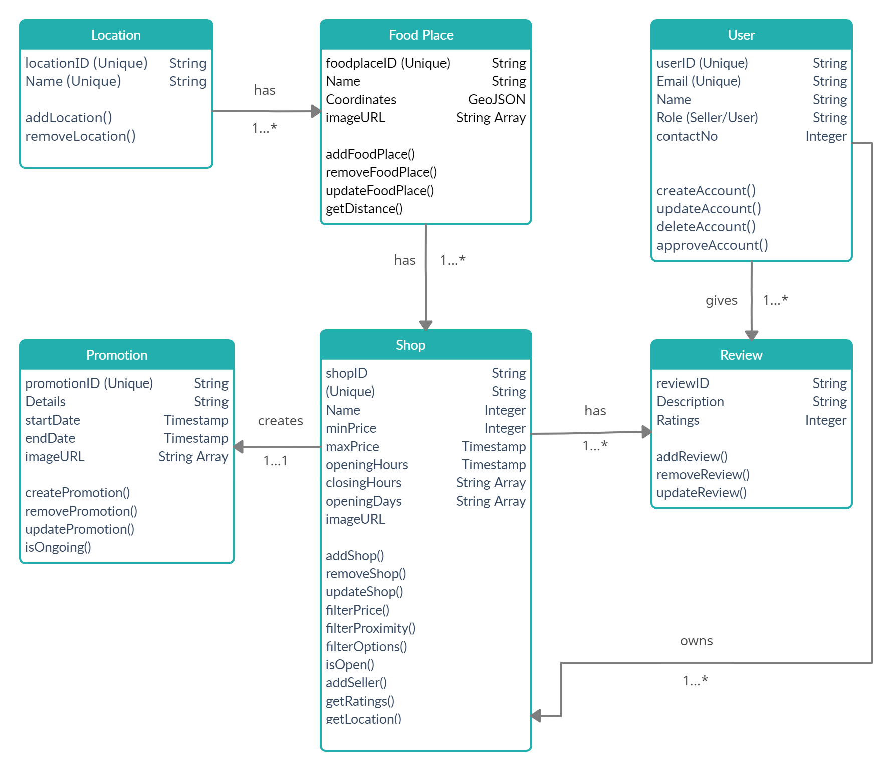
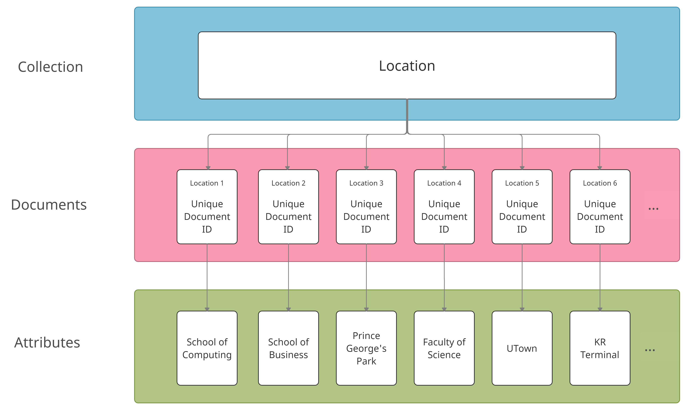
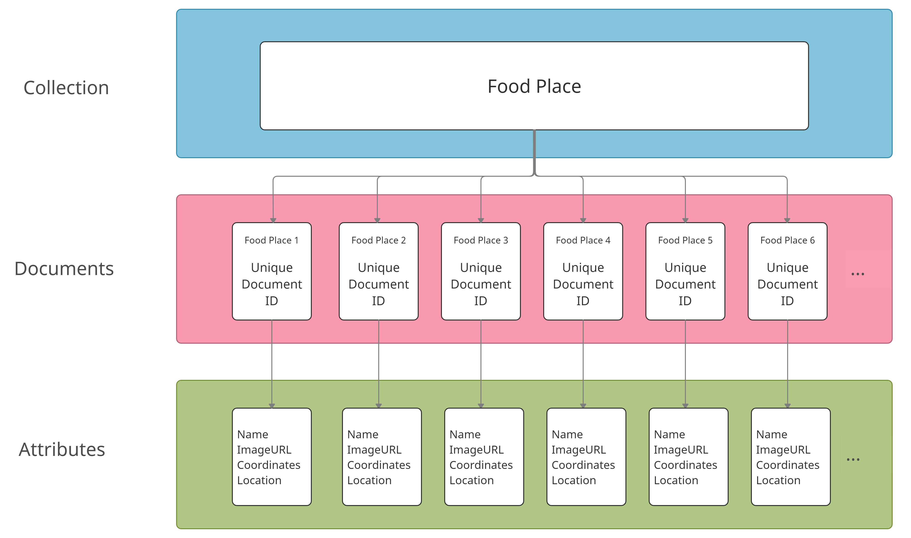
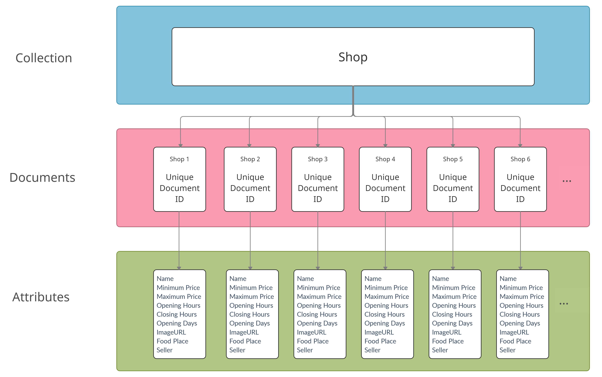
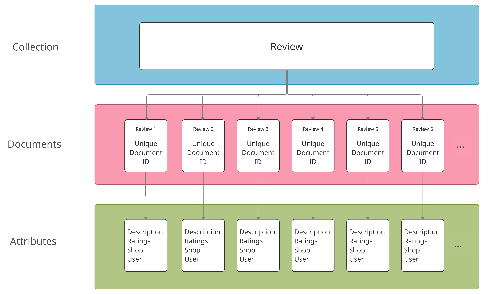
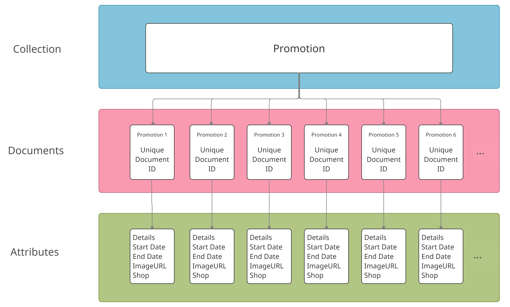
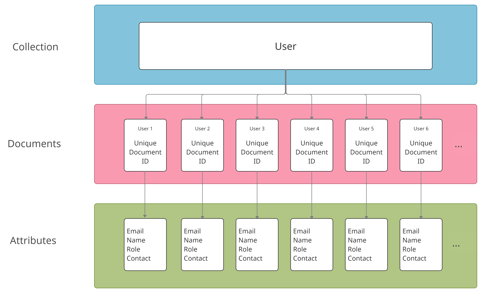
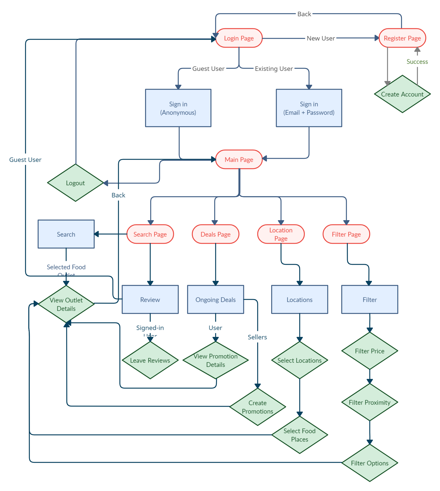

# foodies

A user-friendly, intuitive application to obtain information on all food choices within NUS. Users can search, filter, review, view promotions and more! Sellers can also update opening hours, post promotions and updates on latest happenings. 

# Motivation
We believe that at times when we are with our friends in NUS, we ask this question, “Where are we going to eat?”, and usually the replies range from “I don’t know” to “There’s nothing suitable here”. There is a plethora of food choices in NUS and many different kinds of food at diverse price ranges to cater to everyone. Sometimes, people prefer to save money and pick cheaper options. Other times, people need to find halal options or just grab a quick lunch nearby. However, NUS students or staff may not know what all their available options are. 

There is also insufficient technology or facilities for sellers to relay information about their stall to students, for example menu, operating times and deals. People are thus unable to obtain timely and accurate information about these food places which makes decisions more difficult.

Therefore, we believe that with an intuitive mobile app filled with a multitude of functionalities, sellers can provide information and updates about their store, and people can easily make informed decisions about where their meal should be.

## Aim
We aim to create a useful app displaying food places that has functionalities catered to everyone, be it for new NUS students, foreign exchange students, current NUS staff/students or even just indecisive people. The users of the app will be able to get information about food available at different locations and time in NUS. They can search for specific categories, price ranges, location and more. Instead of going to the same few food places they know about, users can discover new options they never knew about or derive a greater satisfaction from their meals. 

Owners of food stalls/ establishments in NUS will also be able to upload details, pictures, promotions and more on the app which serves as both accurate information for potential customers as well as advertising/promotion. As many of them tend to be older, we aim to make our app as intuitive and as user-friendly as possible. 

Overall, we hope to offer a simple and convenient way for anyone, be it if one is from NUS or not, to search and discover food places within NUS.

## User Stories
- As a new NUS student, I want to know more about where I can eat near my faculty
- As a foreign student, I want to know more about food places in NUS and their options
- As a NUS student, I want to know which other places I have not eaten at and want to try today
- As a NUS student on a budget, I want to know what are the cheapest food options
- As a NUS student, I want to know which places are currently offering promotions or deals
- As a NUS student with a short 1 hour break in between two lectures, I want to know about the options available at nearby places within 15 minutes of walk
- As a NUS student with a craving, I want to know which places offer western/japanese/etc food
As a Muslim NUS student, I want to know which places offer halal food
- As a NUS student who just finished my examinations, I want to look for a fancy place to eat and celebrate
- As a non-NUS student, I do not know the way around and where food places are, but I am hungry and would like to look for a place to eat
- As a NUS student, I am very tired and am too lazy to queue for food. I would like to go to a place with less crowd
- As a NUS/non-NUS student, I have not tried this place before, is it good?
- As a stall owner, I would like to update the opening hours of my store for the coming week
- As a stall owner, I want to advertise this promotion I am having to students and staff of NUS 
- As a stall owner, I would like to add a new item to my menu

# Features
1. Signups and Login

Our application will feature a login system at the start page. Users who have an account can choose to login with their email and password. New users can also create an account via the click of a button at the start page. The signup and login feature is for users to leave reviews and ratings about the food outlets on the application. For users who just want to use the app without the functionality of leaving reviews and ratings do not need to go through the hassle of creating a new account, and they can choose to login as a guest instead. There will be a password reset system for users who forgot their password.

In addition to normal users, sellers who own the food outlets can choose to sign up on the app as a seller too. As a seller, signing up and logging in on the app will allow them to perform several tasks such as submitting a request to update their store information (e.g. menu, operating hours) and also create new promotions to attract people to their stores, which will be shown in one of the features. As a seller, they will not be able to leave a review like the normal users and they have to be manually approved, with additional information required such as the outlets they own.

2. Filtering

Under the filter function on the main page of the application, the user can choose to filter food outlets based on several metrics they have chosen to fit their tastes and preferences. Information of the food outlets will be stored and filtered accordingly.

Firstly, the user will be able to choose the price range of the food they want to consume. They can adjust the slider to choose food outlets that have food options around the price range. Next, they will be able to filter the proximity of the food outlets from their current location. It will be ranked according to the distance and they can pick which location is within traveling distance for them. Lastly, the food outlets will be tagged according to the dietary requirements (e.g. halal or vegetarian) and cuisines (e.g. Japanese, Western) that they offer. The user will then be able to filter out these options as they deem fit.

After selecting all the options that fit their criteria, they can press the filter button and the remaining suitable choices that fit all these metrics will be displayed to the user.

3. Deals and Promotions

The next function on the main page of the application is the deals and promotions tab, where the users can find out the ongoing deals that are offered to food outlets on campus. The user can press on it to find out about the details of the promotion, such as the start and end dates, the outlets offering the promotions or other relevant information.

The deals and promotions can be manually updated, or it can also be updated by approved and verified sellers. These sellers can create an account on the app, then create new promotions or deals featuring their shops and providing the relevant details.

4. Locations

There will be a location function on the main page of the application, where the user can press to find out about the different locations in the school (e.g. School of Computing, UTown, Faculty of Science). The user will then be able to press on the different locations and find out about the food places and shops that are available in the general location. There will also be an additional feature where the approximate current location of the user is shown on the map to ease exploring different food choices nearby.

5. Search

The next function on the main page of the application is the search function. Via the search function, the users can search for specific outlets. They will be able to find out more about the specific outlets such as their opening hours, menu or user ratings and reviews for the outlet itself. 

The user can also choose to leave their ratings and reviews for the specific outlet given that they have created an account and logged in onto the application. The user will be able to only leave one review for the outlet, and they can edit so afterwards.

Besides searching for specific outlets, there will be a recommendations tab upon pressing on the search function. Certain outlets can be recommended to the user via metrics such as ratings.

## Possible Extensions
Several extensions can be integrated into the application if time allows. One of the possible extensions is announcements at the main page of the application to show any important information or special arrangements, such as different operating hours during school holidays. There can also be the integration of real-time location into the application. There can be approximate crowd levels shown at different hours of the days in specific food outlets.

# Class Diagram

# Database Structure

# Programme Flow

# Build Process

If you would like to try out the app, do follow the intructions below:

## Using an Emulator
1. Download and install [Flutter](https://www.geeksforgeeks.org/how-to-install-flutter-on-visual-studio-code/)
2. Clone or download this repository
3. Using `flutter pub get` in the terminal, obtain the relevant dependencies for `pubspec.yaml`
4. Set up an [emulator](https://www.geeksforgeeks.org/how-to-set-up-an-emulator-for-vscode/?ref=lbp)
5. Open the folder as well as the emulator containing the source code, then run it. The app should appear on the emulator. 

## Using Physical Android Device
1. Enable Developer options and USB debugging on your device. Detailed instructions are available in the [Android documentation](https://developer.android.com/studio/debug/dev-options)
2. Using a USB cable, plug your phone into your computer and authorise access to your computer
3. Using `flutter pub get` in the terminal, obtain the relevant dependencies for `pubspec.yaml`
4. Select your Android device.
5. Run the command `flutter run` in the terminal and the application should be installed onto your device.

# Detailed Documentation
For detailed documentation, do refer to the link [here](https://docs.google.com/document/d/1s0gJMcxUtR9Nez6d2XyC_h4tIFBrB-31Xc6zF2vcSlM/edit#heading=h.1vjixcg8y918)

# Progress
- [Introductory Video / Basic Overview](https://drive.google.com/file/d/1Yywd7pKEY0sadhKXFboSPynAFABf-8-M/view?usp=sharing)

## Milestone 1
- [Poster](https://drive.google.com/file/d/1h-1K361ssC8_updcyy1M5O_Oz2IlgRGk/view?usp=sharing)
- [Technical Proof-Of-Concept Video](https://drive.google.com/file/d/1EpQ1p2o1Wk2iREh1d8WxDZ-3jSGvJiyd/view?usp=sharing)